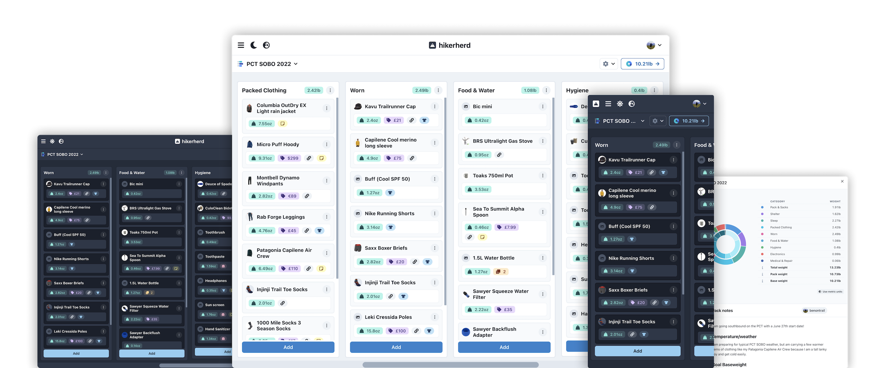

<h1 align="center">⛰️ hikerherd</h1>

> hikerherd helps you plan your adventures and organize your gear while reducing the weight of your pack.

[Go to hikerherd](https://www.hikerherd.com) to start managing your gear.

## Developer quick start

### Prerequisites

- [Node JS](https://docs.npmjs.com/downloading-and-installing-node-js-and-npm)
- [Yarn](https://classic.yarnpkg.com/lang/en/docs/install/#mac-stable)
- [PostgreSQL](https://www.postgresql.org/)

### Documentation

hikerherd is built in TypeScript, React, and Node using BlitzJS. Blitz is a framework based on NextJS. You can read [the Blitz docs](https://blitzjs.com/docs) to find out more.

#### Initial set up

Documentation for the setup, development and deployment of hikerherd is a [work in progress](https://github.com/benhoneywill/hikerherd/issues/29), but the following should be enough to get started:

1. Set up local or remote postgres databases for development and testing.
2. Set up your environment variables by following the instructions in `.env.example`.
3. `yarn install` to install dependencies
4. `yarn dev` to run the development server
5. `yarn test` to run tests, or `yarn cypress:dev` to run cypress tests

## Contribution Policy

#### Bugs & documentation

Code contributions for bug fixes and documentation are very welcome. To report a bug, Please [open an issue](https://github.com/benhoneywill/hikerherd/issues/new/choose) here on github.

#### Features

If you have ideas for the project, I would love to hear from you! Visit the [GitHub Discussions](https://github.com/benhoneywill/hikerherd/discussions) to start a conversation. I am always excited to hear from people who are using hikerherd and have constructive input for how it could be improved.

I am not currently looking for code contributions for new features. Feature PRs are a lot of work for me to review and they carry an ongoing maintenance burden, I can't currently dedicate enough time to managing outside contributions. The best way to contribute right now is to report bugs and get involved in feature discussions!

If you have something you desperately want to see in hikerherd then please start a discussion, and we can decide if it is something that should be implemented. If not, you are always free to fork the project and add it yourself.

## Show your support

#### Like and share

Drop the project a ⭐️ if you like hikerherd, and share the app with anyone you think might like it.

#### Buy me a coffee

If you use hikerherd and want to support the app, you can show your support by [buying me a coffee](https://ko-fi.com/benontrail).

## Author

**🧑‍💻 Ben Honeywill**

- 💻 Website [benhoneywill.com](https://benhoneywill.com)
- 🐦 Twitter [@benhoneywill](https://twitter.com/benhoneywill)
- 🧑‍🎓 LinkedIn [@benhoneywill](https://linkedin.com/in/benhoneywill)
- 📸 Instagram [@benontrail](https://instagram.com/benontrail)
